```{r setup, include=FALSE}
knitr::opts_chunk$set(echo = TRUE)
```

## What you will need
1. Git ... since the Hack Oregon repositories live on GitHub, install the GitHub Desktop from <https://desktop.github.com/>.
2. If you need to capture screenshots, install Sizer (<http://www.brianapps.net/sizer/>) and Greenshot (<http://getgreenshot.org/>). I captured the screenshots for this tutorial with them.

Open source installation on Windows can be frustrating. The developers try their best to make things easy, but you'll still find it frustrating. Please, do yourself a favor and read through all of the instructions below once before you start going to websites, downloading packages and installing them.

## PostgreSQL
First, you need to install PostgreSQL. I recommend the EnterpriseDB installer, which includes PostgreSQL administration tools and an installer for PostGIS.

1. Go to <http://www.enterprisedb.com/downloads/postgres-postgresql-downloads> and download the installer. ***Make sure you get the 9.5 release; that's what the Database Engineering class is using.***

    Download links:
    
    * 64-bit Windows: <http://www.enterprisedb.com/postgresql-955-installers-win64>
    * 32-bit Windows: <http://www.enterprisedb.com/postgresql-955-installers-win32>
    * MacOS: <http://www.enterprisedb.com/postgresql-955-installers-osx>
2. When the download finishes, double-click the downloaded installer. You'll need to authorize the install, then after a few operations you'll get this screen. Press "Next".

    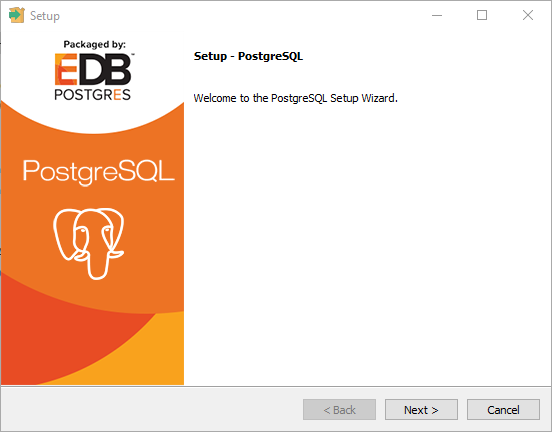
3. Accept the default install location on this screen with "Next".

    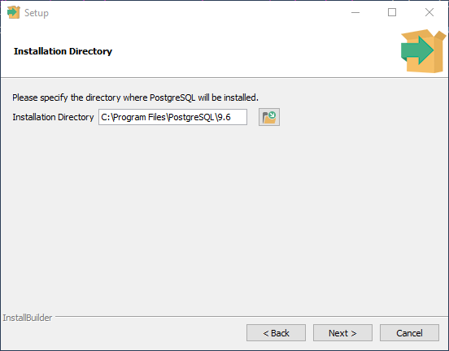
4. Accept the default data directory on this screen with "Next".

    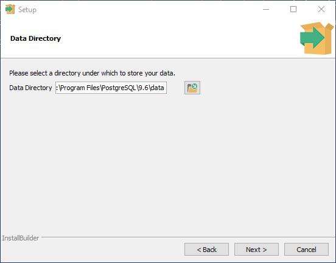
5. ***This screen is important! Here you will set the password for the PostgreSQL super-user, named "postgres". As usual, you need a strong password, something easy for you to remember and impossible for anyone else to figure out. Enter your password twice and press "Next".***

    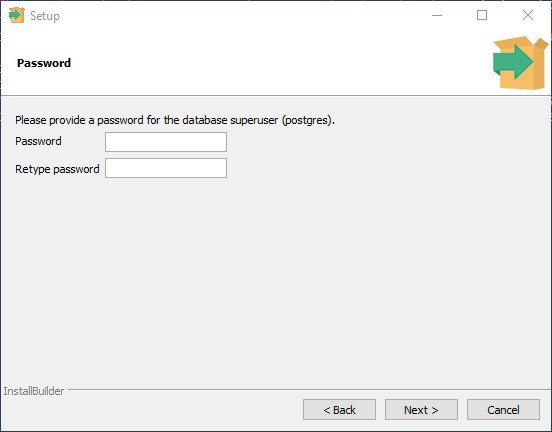
6. On the "Port" screen, accept the default port "5432" with "Next".

    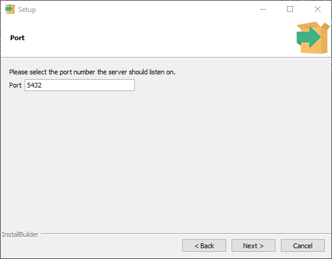
7. On the "Advanced Options" screen, accept the default locale with "Next".

    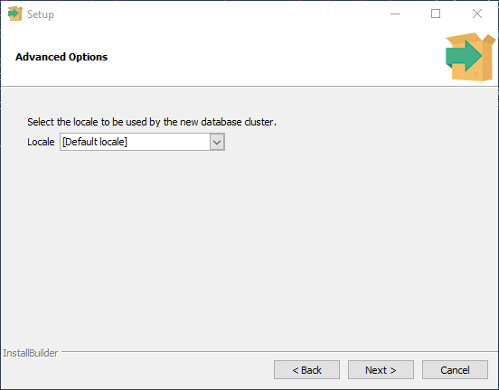
8. Press "Next" on the "Ready to Install" screen to install PostgreSQL.

    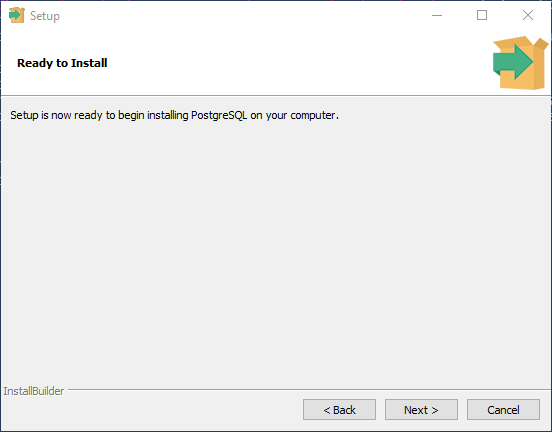
9. When the PostgreSQL install is done, you'll get this screen. If you're not doing any GIS work, just PostgreSQL database work, you can stop here. Otherwise, you'll need to continue and install PostGIS using the Stack Builder. Please, don't install PostGIS unless you need it. If you find you need it later, you can start up the Stack Builder again and install PostGIS.

	* To exit now, uncheck the Stack Builder checkbox and press "Finish".
	* To proceed to PostGIS, check the Stack Builder checkbox and press "Finish".
	
	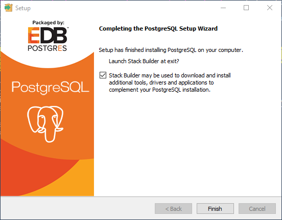

## PostGIS via Stack Builder
1. This is the first screen you'll get from Stack Builder. Pull down the drop-down and select the PostgreSQL database you just installed. Then press "Next".

    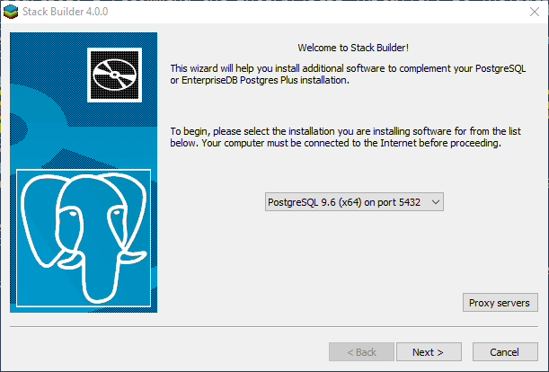
2. You will get a screen with a menu of available add-ons. Expand the "Spatial Extensions" item with the plus sign. Choose 32-bit or 64-bit depending on whether you installed 32-bit or 64-bit PostgreSQL. Then press "Next".

    
3. On the review screen, accept the default download location and press "Next".

    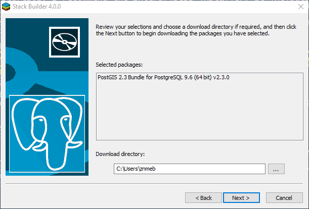
4. When the download is finished, you'll get this screen. Make sure the "Skip Installation" checkbox is ***cleared*** and press "Next".

    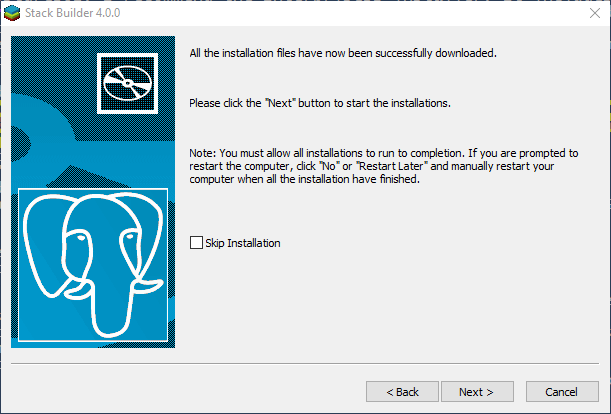
5. On this screen, press "I Agree" to accept the license.

    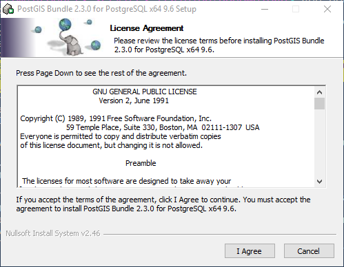
6. On the "Choose Components" screen, make sure PostGIS is checked and "Create spatial database" is cleared. Then press "Next".

    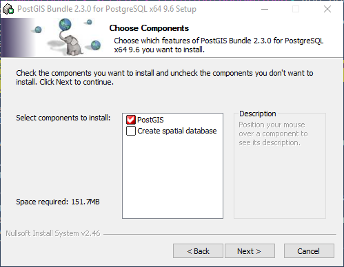
7. On the "Choose Install Location", accept the default with "Next".

    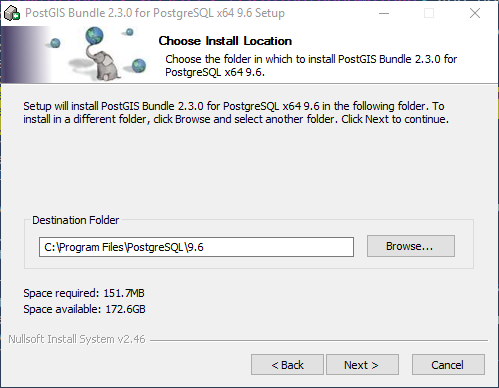
8. When you get this "GDAL_DATA" question, answer "Yes".

    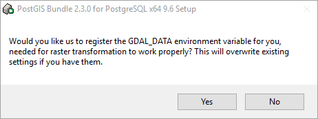
9. When you get this "raster drivers" question, answer "Yes".

    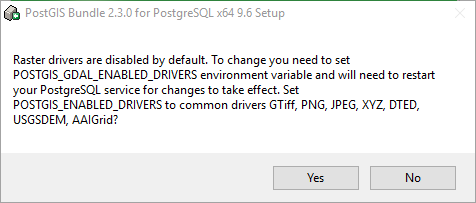
10. When you get this "raster out of db" question, answer "Yes".

    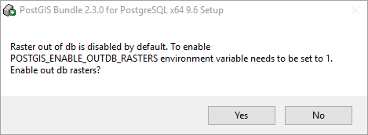
11. When you get this "Installation Complete" screen, press "Close".

    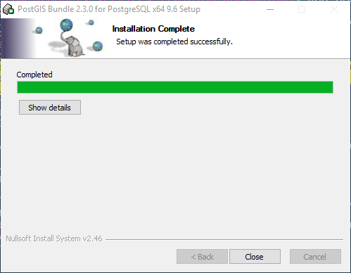
12. Now you'll get an "Installation Completed" screen from Stack Builder. Press "Finish".

    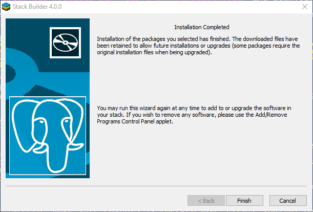

## PostgreSQL Administration / Setup
There are two PostgreSQL administration tools, a command-line tool called "SQL Shell (psql)" and a GUI tool called "PgAdmin". To enable scripting, code review and reproducibility, I recommend learning psql. However, PgAdmin can do everything psql can do and if you're not comfortable with coding, go ahead and use PgAdmin.

Whether or not you installed PostGIS above, you will need to do this setup. I'll show the psql commands.

## OSGeo4W
Now you have PostgreSQL and PostGIS. The final component of the GIS stack is OSGeo4W (<http://trac.osgeo.org/osgeo4w/>). Like the previous two open source installers, this one is loaded with stop points and you'll be accepting the defaults for most of them.

A note on licensing: there are four components that have non-standard licenses. What's worse, there's no way to complete the install unless you accept these licenses. I discovered this a few years ago when I went through this process. I complained to the OSGeo4W developers about it, but I see they still have this "feature". 

As far as I know Hack Oregon won't get into trouble for using these packages, but I'm planning to check with the upstream developers to see if we really need the component(s) that depend on these packages. Stay tuned!

1. For a 32-bit Windows, download <http://download.osgeo.org/osgeo4w/osgeo4w-setup-x86.exe>. For 64-bit Windows, download <http://download.osgeo.org/osgeo4w/osgeo4w-setup-x86_64.exe>. Double-click the installer to start.
2. After authorizing the install, you'll get this screen. Accept the default "Express Desktop Install" and press "Next".

    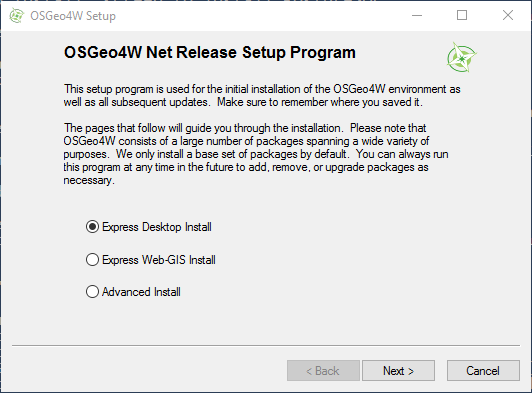
3. In the "Choose A Download Site", ***you will need to highlight the default site with the mouse***. Then press "Next".

    .png)

4. In the "Select Packages" sreen, accept the defaults (QGIS, GDAL and GRASS GIS) and press "Next".

    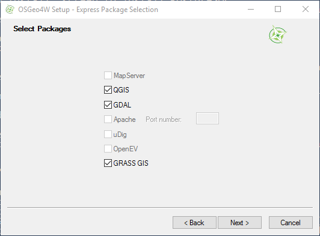
5. "Warning! Unmet Dependencies Found": make sure the "install these packages" checkbox at the bottom is checked and press "Next".

    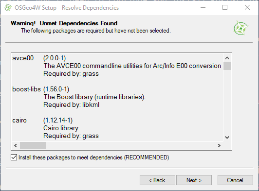
6. "Agreement of Restrictive Packge" - ECW Raster Plugin: You have to accept this or the install will not proceed. :-( Check the "I agreed" checkbox and press "Next".

    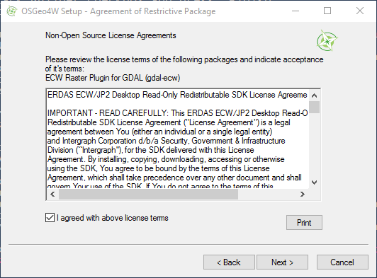

7. "Agreement of Restrictive Packge" - MrSID Raster Plugin: You have to accept this or the install will not proceed. :-( Check the "I agreed" checkbox and press "Next".

    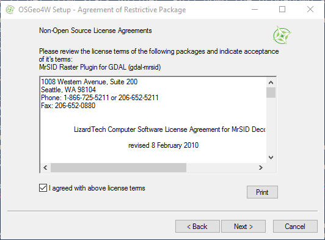
8. "Agreement of Restrictive Packge" - Oracle Instant Client: You have to accept this or the install will not proceed. :-( Check the "I agreed" checkbox and press "Next".

    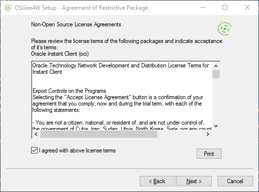
9. "Agreement of Restrictive Packge" - SZIP compression library: You have to accept this or the install will not proceed. :-( Check the "I agreed" checkbox and press "Next".

    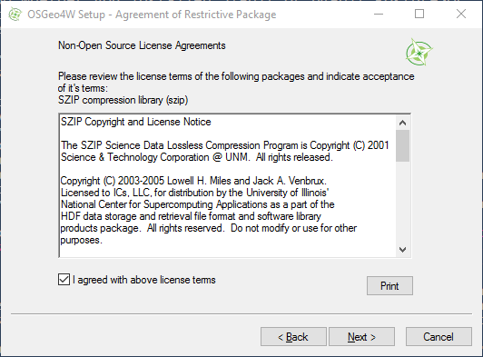
10. Finally, the install will start. The OSGeo4W install will take some time to download and install everything. When the install finishes, you'll get this screen. Press "Finish".

    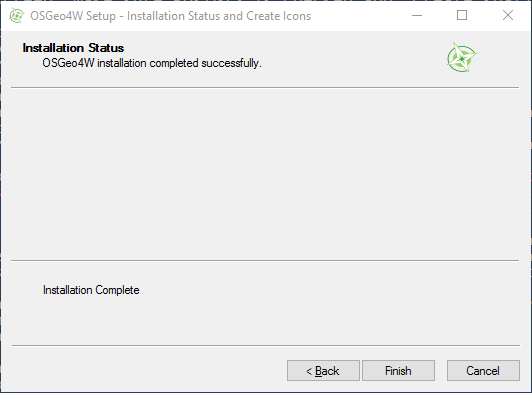

## Connecting PostGIS and QGIS
Now you have PostgreSQL, PostGIS and OSGeo4W installed. The final step is to connect QGIS to PostGIS so you can manage your data, make maps, etc.
